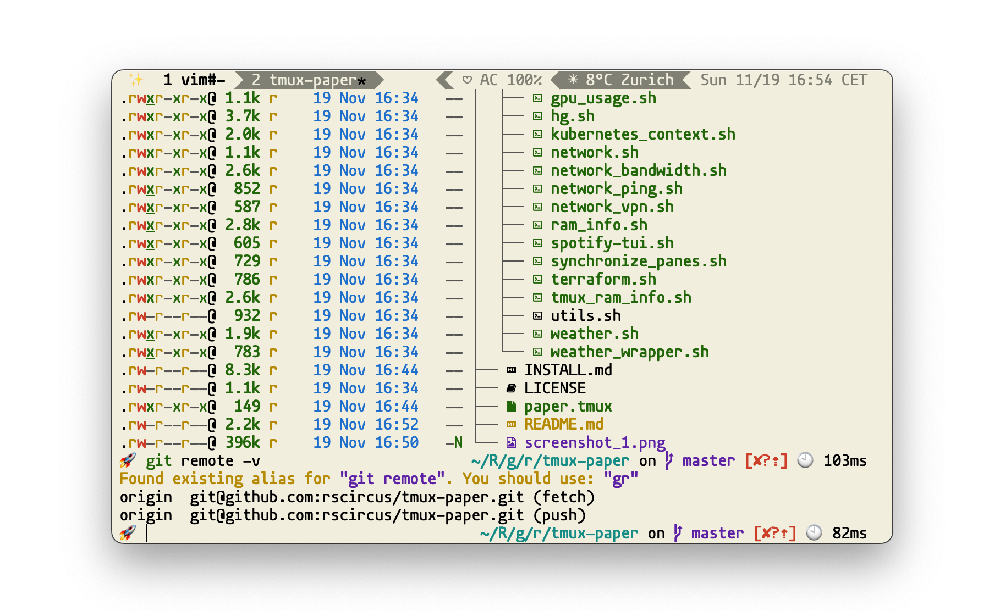
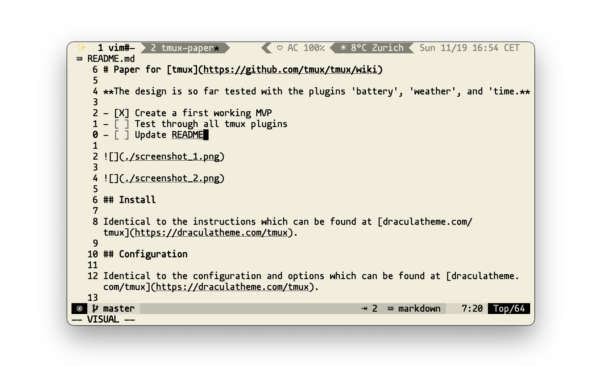

# Paper for [tmux](https://github.com/tmux/tmux/wiki)

**The design is so far tested with the plugins 'battery', 'weather', and 'time.**

- [X] Create a first working MVP
- [ ] Test through all tmux plugins
- [ ] Update README

## Install

Identical to the instructions which can be found at [draculatheme.com/tmux](https://draculatheme.com/tmux).

## Configuration

Identical to the configuration and options which can be found at [draculatheme.com/tmux](https://draculatheme.com/tmux).

## Features

- Support for powerline
- Day, date, time, timezone
- Current location based on network with temperature and forecast icon (if available)
- Network connection status, bandwidth and SSID
- Git branch and status
- Battery percentage and AC power connection status
- Refresh rate control
- CPU usage (percentage or load average)
- RAM usage (system and/or tmux server)
- GPU usage
- Custom status texts from external scripts
- GPU VRAM usage
- GPU power draw
- Color code based on if prefix is active or not
- List of windows with current window highlighted
- When prefix is enabled smiley face turns from green to yellow
- When charging, 'AC' is displayed
- If forecast information is available, a ☀, ☁, ☂, or ❄ unicode character corresponding with the forecast is displayed alongside the temperature
- Info if the Panes are synchronized
- Spotify playback (needs the tool spotify-tui installed)
- Current kubernetes context
- Countdown to tmux-continuum save
- Current working directory of tmux pane

## Compatibility

Compatible with macOS and Linux. Tested on tmux 3.1b
FreeBSD compatibility is in development

## Dracula Community

On which these files are based:

- [Dane Williams](https://github.com/danerwilliams)
- [Ethan Edwards](https://github.com/ethancedwards8)
- [Twitter](https://twitter.com/draculatheme) - Best for getting updates about themes and new stuff.
- [GitHub](https://github.com/dracula/dracula-theme/discussions) - Best for asking questions and discussing issues.
- [Discord](https://draculatheme.com/discord-invite) - Best for hanging out with the community.

## License

[MIT License](./LICENSE)
